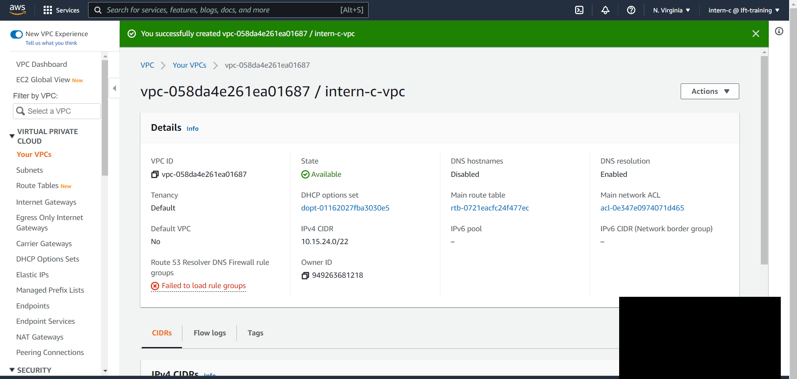
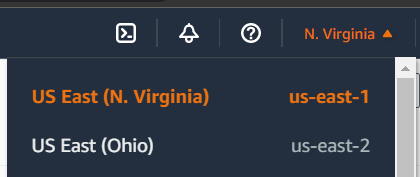
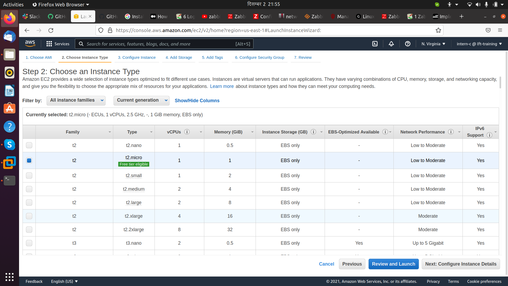
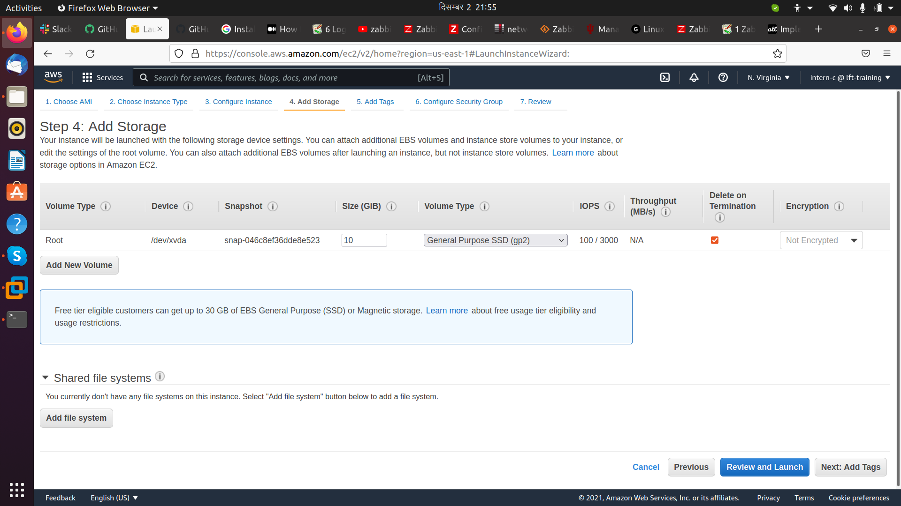
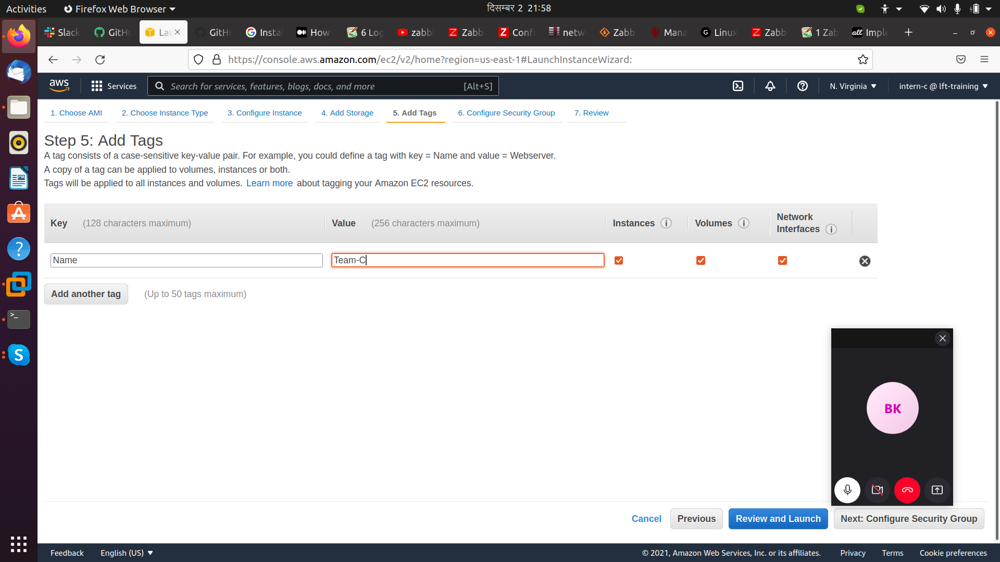
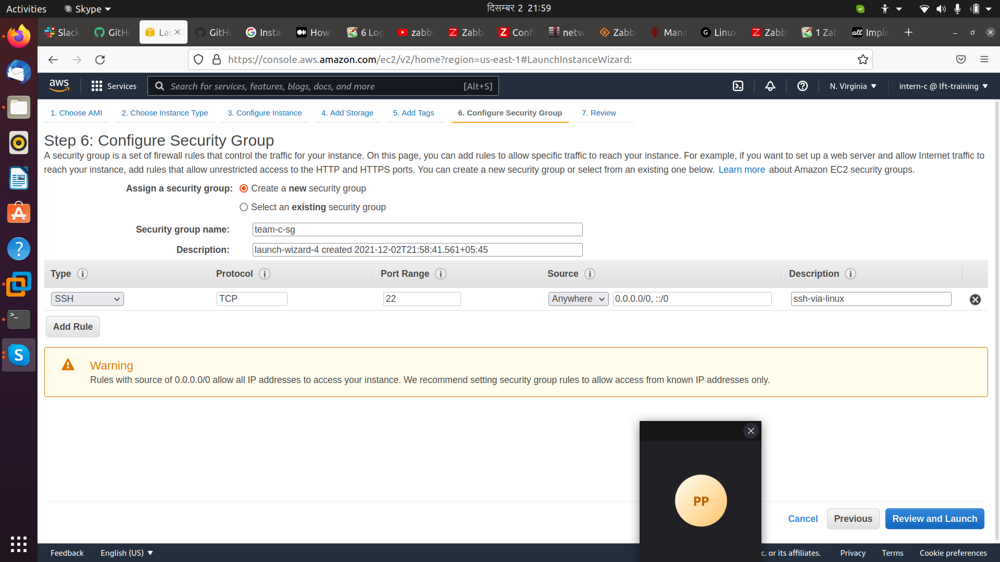
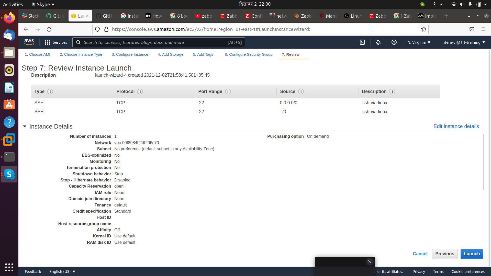
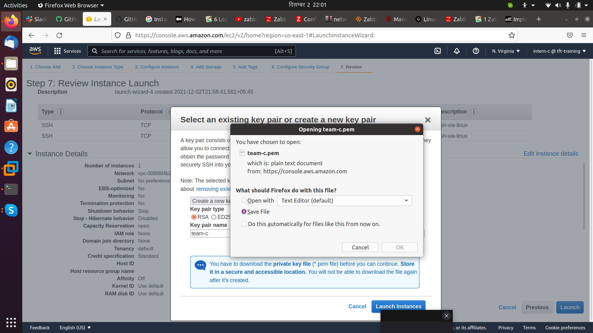
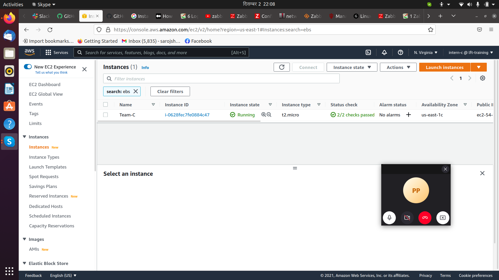
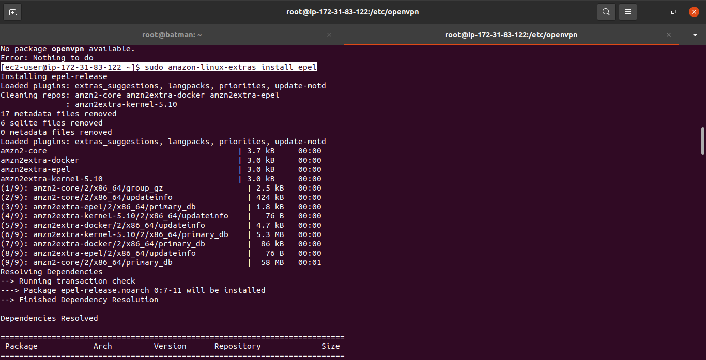

# AWS Cloud

> 1. Create a VPC with CIDR 10.15.{8*team#}.0/22; no custom subnets.

- Using us-east-1 AZ

> 2. Start a EC2 (in default VPC of the region)
 a. Amazon Linux OS
 b. Use t2.micro instance (Free Tire)

> c. Attach 10GB General EBS (detachable)

 
> d. Should be publicly accessible
  e. Access the the EC2 via SSH

> f. Install OpenVPN package inside the EC2

